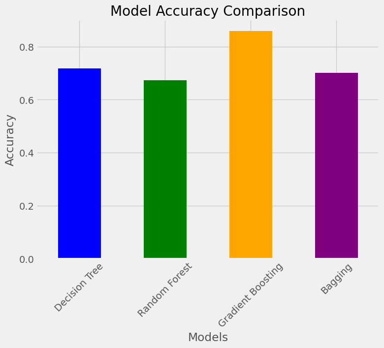
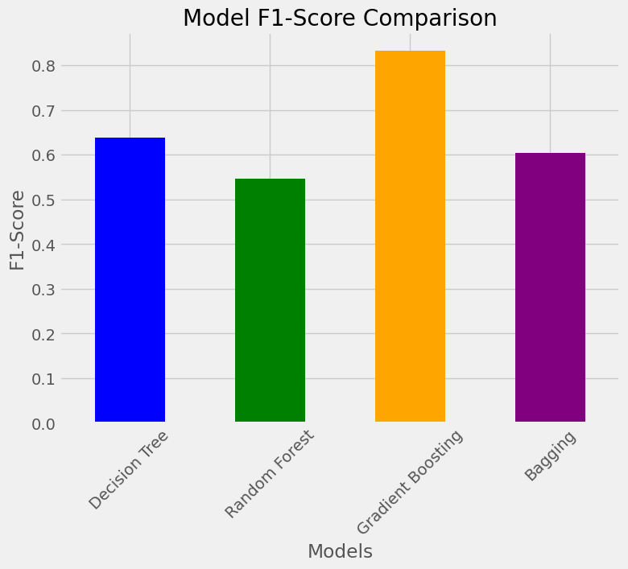
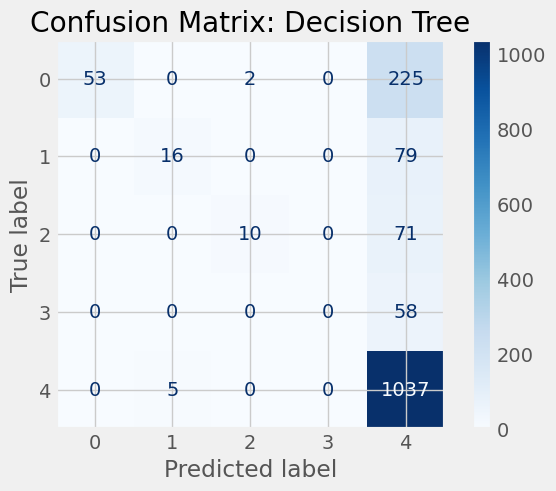
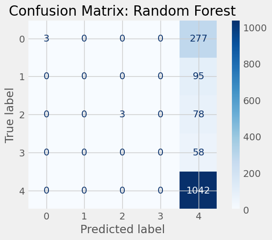
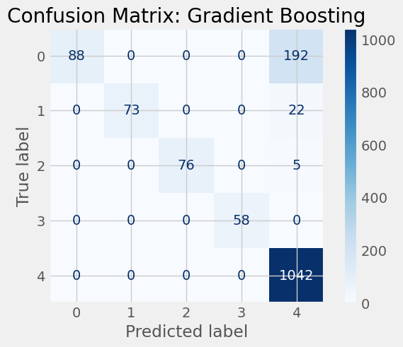
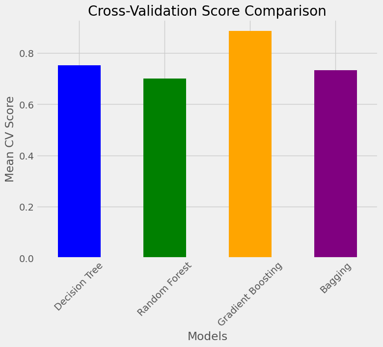

```python
import numpy as np
import pandas as pd
import matplotlib.pyplot as plt

from sklearn.preprocessing import LabelEncoder
from sklearn.tree import DecisionTreeClassifier
from sklearn.ensemble import RandomForestClassifier, BaggingClassifier, GradientBoostingClassifier
from sklearn.metrics import accuracy_score, precision_score, recall_score, f1_score, roc_curve, auc, classification_report
from sklearn.metrics import ConfusionMatrixDisplay
from sklearn.model_selection import cross_val_score, train_test_split
from sklearn.feature_extraction.text import TfidfVectorizer
```

## Data Cleaning

```python
# df_smol = pd.read_csv('aita778.csv')
df_big = pd.read_csv('aita7780.csv')
```

```python
print(df_big.isnull().sum())
```

    Unnamed: 0    0
    id            0
    flair         0
    title         0
    body          0
    dtype: int64

```python
#convert flair (outcome var) to numerical vals
le = LabelEncoder()
df_big['flair_num'] = le.fit_transform(df_big['flair'])
```

```python
#split into test / train 

X = df_big['title']
y = df_big['flair_num']

X_train, X_test, y_train, y_test = train_test_split(X,y,test_size=0.2,random_state=17)
```

```python
df_big['title'][2]

```
    'AITA for preferring that my uncle teach me to drive than my dad and refusing to tell my dad why?'

```python
tfidf = TfidfVectorizer(max_features=5000)
```

```python
X_train_tfidf = tfidf.fit_transform(X_train)
X_test_tfidf = tfidf.transform(X_test)
```

```python
dt_model = DecisionTreeClassifier(random_state=17, max_depth=10)
dt_model.fit(X_train_tfidf, y_train)

y_pred_dt = dt_model.predict(X_test_tfidf)
```

```python
temp = dt_model.fit(X_train_tfidf, y_train)

fig = plt.figure(figsize=(25,20))
_ = tree.plot_tree(temp,
                   filled=True)
```

```python
print('Decision Tree Accuracy:',accuracy_score(y_test,y_pred_dt))
```
    0.7172236503856041

```python
print(classification_report(y_test,y_pred_dt))
```

                  precision    recall  f1-score   support
    
               0       1.00      0.19      0.32       280
               1       0.76      0.17      0.28        95
               2       0.83      0.12      0.22        81
               3       0.00      0.00      0.00        58
               4       0.71      1.00      0.83      1042
    
        accuracy                           0.72      1556
       macro avg       0.66      0.30      0.33      1556
    weighted avg       0.74      0.72      0.64      1556

```python
rf_model = RandomForestClassifier(random_state=17, max_depth=10, n_estimators=100)
rf_model.fit(X_train_tfidf, y_train)

y_pred_rf = rf_model.predict(X_test_tfidf)
print("Random Forest Accuracy:", accuracy_score(y_test, y_pred_rf))
print(classification_report(y_test, y_pred_rf))

```

    Random Forest Accuracy: 0.6735218508997429
                  precision    recall  f1-score   support
    
               0       1.00      0.01      0.02       280
               1       0.00      0.00      0.00        95
               2       1.00      0.04      0.07        81
               3       0.00      0.00      0.00        58
               4       0.67      1.00      0.80      1042
    
        accuracy                           0.67      1556
       macro avg       0.53      0.21      0.18      1556
    weighted avg       0.68      0.67      0.55      1556
    

```python
base_tree = DecisionTreeClassifier(max_depth=5, random_state=17)
bagging_model = BaggingClassifier(estimator=base_tree, n_estimators=50, random_state=17)
bagging_model.fit(X_train_tfidf, y_train)

y_pred_bagging = bagging_model.predict(X_test_tfidf)
print("Bagging Accuracy:", accuracy_score(y_test, y_pred_bagging))
print(classification_report(y_test, y_pred_bagging))

```

    Bagging Accuracy: 0.7011568123393316
                  precision    recall  f1-score   support
    
               0       1.00      0.12      0.21       280
               1       1.00      0.07      0.14        95
               2       1.00      0.11      0.20        81
               3       0.00      0.00      0.00        58
               4       0.69      1.00      0.82      1042
    
        accuracy                           0.70      1556
       macro avg       0.74      0.26      0.27      1556
    weighted avg       0.76      0.70      0.60      1556


```python
gb_model = GradientBoostingClassifier(random_state=17)
gb_model.fit(X_train_tfidf, y_train)

y_pred_gb = gb_model.predict(X_test_tfidf)
print("Gradient Boosting Accuracy:", accuracy_score(y_test, y_pred_gb))
print(classification_report(y_test, y_pred_gb))

```

    Gradient Boosting Accuracy: 0.859254498714653
                  precision    recall  f1-score   support
    
               0       1.00      0.31      0.48       280
               1       1.00      0.77      0.87        95
               2       1.00      0.94      0.97        81
               3       1.00      1.00      1.00        58
               4       0.83      1.00      0.90      1042
    
        accuracy                           0.86      1556
       macro avg       0.97      0.80      0.84      1556
    weighted avg       0.88      0.86      0.83      1556

```python
##Collect Merics for cCOmparison 
def eval_model(model, X_test, y_test):
    y_pred = model.predict(X_test)
    return{
        'Accuracy':accuracy_score(y_test, y_pred),
        'Precision': precision_score(y_test,y_pred,average='weighted'),
        'Recall':recall_score(y_test,y_pred,average='weighted'),
        'F1-Score': f1_score(y_test,y_pred, average='weighted')
    }
```

```python
metrics = {
    'Decision Tree': eval_model(dt_model, X_test_tfidf,y_test),
    'Random Forest': eval_model(rf_model, X_test_tfidf, y_test),
    'Gradient Boosting': eval_model(gb_model, X_test_tfidf, y_test),
    'Bagging': eval_model(bagging_model, X_test_tfidf, y_test)
}
```

```python
metrics_df = pd.DataFrame(metrics)
print(metrics_df)
```

               Decision Tree  Random Forest  Gradient Boosting   Bagging
    Accuracy        0.717224       0.673522           0.859254  0.701157
    Precision       0.742257       0.682193           0.883698  0.756093
    Recall          0.717224       0.673522           0.859254  0.701157
    F1-Score        0.638219       0.545953           0.832780  0.604238

```python
metrics_df = metrics_df.T
print(metrics_df)
```

                       Accuracy  Precision    Recall  F1-Score
    Decision Tree      0.717224   0.742257  0.717224  0.638219
    Random Forest      0.673522   0.682193  0.673522  0.545953
    Gradient Boosting  0.859254   0.883698  0.859254  0.832780
    Bagging            0.701157   0.756093  0.701157  0.604238

```python
metrics_df['Accuracy'].plot(kind='bar', color=['blue', 'green', 'orange', 'purple'], figsize=(8, 6))
plt.style.use('fivethirtyeight')
plt.title('Model Accuracy Comparison')
plt.ylabel('Accuracy')
plt.xlabel('Models')
plt.xticks(rotation=45)
plt.show()
```



```python
metrics_df['F1-Score'].plot(kind='bar', color=['blue', 'green', 'orange', 'purple'], figsize=(8, 6))
plt.title('Model F1-Score Comparison')
plt.ylabel('F1-Score')
plt.xlabel('Models')
plt.xticks(rotation=45)
plt.show()

```



```python
models = [("Decision Tree", dt_model), 
          ("Random Forest", rf_model), 
          ("Gradient Boosting", gb_model), 
          ("Bagging", bagging_model)]

for name, model in models:
    disp = ConfusionMatrixDisplay.from_estimator(model, X_test_tfidf, y_test, cmap=plt.cm.Blues)
    disp.ax_.set_title(f"Confusion Matrix: {name}")
    plt.show()

```
    

    

    

    

    

```python
cv_scores = {
    "Decision Tree": np.mean(cross_val_score(dt_model, X_train_tfidf, y_train, cv=5)),
    "Random Forest": np.mean(cross_val_score(rf_model, X_train_tfidf, y_train, cv=5)),
    "Gradient Boosting": np.mean(cross_val_score(gb_model, X_train_tfidf, y_train, cv=5)),
    "Bagging": np.mean(cross_val_score(bagging_model, X_train_tfidf, y_train, cv=5))
}
```

```python
cv_scores_series = pd.Series(cv_scores)
cv_scores_series.plot(kind='bar', color=['blue', 'green', 'orange', 'purple'], figsize=(8, 6))
plt.title('Cross-Validation Score Comparison')
plt.ylabel('Mean CV Score')
plt.xlabel('Models')
plt.xticks(rotation=45)
plt.show()
```


    
```python

```
